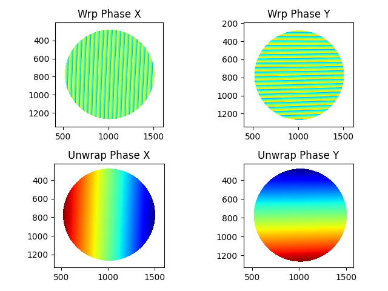
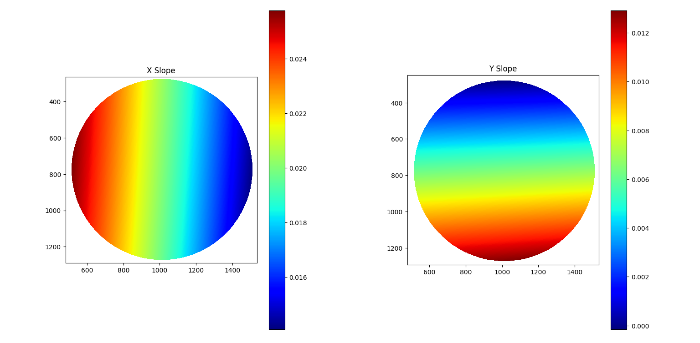

# SCOTSpy - Phase measuring deflectometry system
Contact author : etiennepelletier3@gmail.com

## Description
**SCOTSpy** is aimed at providing a fully functionnal phase measuring deflectometry system written in python code.
The system works by displaying vertical and horizontal sinusoidal fringe patterns on a screen and capturing their reflections
onto a surface under test (SUT) using a camera. By analyzing the fringes images, the slopes of the SUT can be recovered, and through
modal integration using zernike polynomials, the surface height map is obtained. It is based on the famous Software Configurable Optical Test System of Su *et al.* (https://doi.org/10.1364/AO.49.004404). If well calibrated, this system should in theory give measurements similar to interferometry and profilometry systems, but at its current stage of development, SCOTSpy still outputs complete shenanigans. It is therefore considered an incomplete project that will be (hopefully) easily fixed with a bit more elbow grease.

## List of components
- 1 LCD display (here a laptop screen should suffice)
- 1 Camera (EO-3112C usb camera of Edmund Optics was used, but any camera with the same resolution or higher will do)
- 1 Camera lens (here a 25mm is used)
- 1 flat mirror (used for geometry calibration)
- SUT (can be a parabolic, concave, convex mirror or any reflective surface)
- Optical mounts for mirror, SUT and camera
- 1 printed ArUco marker

## How to use it
### 1. Create new test setup
Create a new Test folder in Calibration data/, Measurement data/ and Results/ folders. Copy the *params.json* file of the previous Results/Test X-1 folder in your Results/Test X folder. When running python files, you will be asked to enter your test ID.

**Side note before moving on** : the terminal gives you a lot of informations about each step taking place, but will sometime be occluded by display windows, so don't forget to take a look at it if you're not sure where you're at.

### 2. Calibrate the camera
Calibrating the camera involves calculating its intrinsic parameters using a chess board. Here a Charuco board is used for enhanced calibration. The camera lens should be adjusted to a certain focus length and aperture size that works for your setup (by having both the SUT and the screen's reflection at a resonnable focus) and those parameters **should not be modified during any subsequent steps**, otherwise the camera will have to be recalibrated. To proceed, place the screen display in front of your camera, and run the *camera_calibration.py* file. You can change parameters like your screen pixel size with *sscreenpx* and marker and grid sizes of the Charuco board. You will be asked if you want to take the poses manually (using an external camera software) or automatically (currently only supported for ueye cameras). Multiple chessboard poses should then be taken (the more the better) and OpenCV will do its magic and provide a camera matrix and a distortion coefficients list which are your camera intrinsics parameters. If taking poses automatically, you can change the number of poses with *nb_poses*. If the calibration went smoothly, you can save the intrinsics parameters in a custom json file with your camera setup name.

### 3. Calibrate the system's geometry
This step is used to measure the position of the components of the system with respect to the camera. At this point, you should place the screen, mirror and camera at there final location, as shown below :

Geometry calibration is done by running the *geometry_calibration.py* file.
 **First**, the pose of the screen display is calculated using the method described in https://doi.org/10.1364/OL.37.000620. Essentially, an Aruco marker is displayed on the screen and a flat mirror is used to reflect its image at the camera. Three different poses of the flat mirror are necessary to extract the pose of the screen with respect to the camera. The user can again choose to go with manual or automatic capture. Look at the terminal to see how to proceed. The screen pose is described by a rotation matrix and a translation vector, the latter being the coordinates of the screen with respect to the camera, which is what we really want. **Second**, replace the reference flat mirror with your SUT, and take another picture of the reflected Aruco marker, which in the code is used for the "zerophase pose point". Basically, the pixel coordinates of the center of the marker in the image corresponds to a reference point present in all the fringe patterns images and is used to obtain the absolute phase from the relative phase later on. **Third**, place a printed Aruco marker carefully on the mirror surface so that the center of the marker is approximately coincident with the SUT's center. You can enter the size of the marker by modifying the *printed_marker_size* variable. Taking a picture will give you the pose of the SUT's origin with respect to the camera. **Note** : this last method is terrible. You have to be carefull not to move the mirror, and for unflat SUT it is almost impossible to make the marker flush with the surface. A possible amelioration would be to create a jig with a preinstalled marker that is placed near the SUT with exact knowledge of its position with respect to the SUT center point. **Finally**, the geometry parameters are saved in *params.json*.

### 4. Get the Phases
The following is primarly based on Nielsen and Preumont paper and their Matlab code (https://doi.org/10.3390/s23177316). By running the *phase.py* file, X and Y fringe patterns are displayed and the reflections onto the SUT are captured. Pattern parameters can be modified to suit your setup. There is a constant phase shift between each fringe patterns for a total of 16 patterns in X and Y directions, respectively. Since the retrieval of the relative phase from the pictures takes a long time, the user is asked to create a mask centered at the SUT's origin with a certain radius (bigger radius takes longer). *Make sure that the mask only contains your SUT and not some background object*. The relative phase is then calculated (wrapped phase) and unwrapped using skimage's function. Knowing the pixel location of the zerophase point, the absolute phase is automatically retrieved (this is really just offsetting the relative phase so that at the zerophase point location, the phase is, well you guest it, zero).

### 5. Get the Slopes
This step is again based on Nielsen's and Preumont's work.
This is the critical part where we take all the parameters and phase data we obtained previously and we calculate the slopes in the X and Y directions. All of this should be simple, this is just the law of reflection, but it involves creating and manipulating ndarrays.
(**Note** : this might really be where I messed up. To see how it is done in Matlab, see the *computeSlope.m* code of N&P and their paper). By running the *slopes.py* file, slopes are automatically calculated and saved. The gridspacing is also scaled with *scamerapx*, that is the distance in mm between 2 adjacent pixels in the SUT pictures.

### 6. Get the Surface's height map
This final step reconstructs the SUT surface by fitting the slopes with the X and Y first derivatives of the first 21 zernike polynomials, than summing those zernike modes weighted by their coefficient found during fitting (This is really just solving a matrix equation, see https://doi.org/10.3390/math11183915) For simplicity, I manually entered the expressions of the zernike's first derivatives. Running *surface.py*, the surface of the SUT is reconstructed. An histogram of the weights of each zernike polynomial used for reconstruction is given. Finally, the slopes are recovered from the surface to validate the method. Since there is a problem somewhere in the code, this does not work currently.

# For testing and troubleshooting
**If you don't have a phase measuring deflectometry system at hands, you can still test and try to fix SCOTSpy by using the first 5 tests already made. Tests 1, 2 and 3 used a flat mirror SUT, and tests 4 and 5 used a concave SUT.**

To contact me : etiennepelletier3@gmail.com